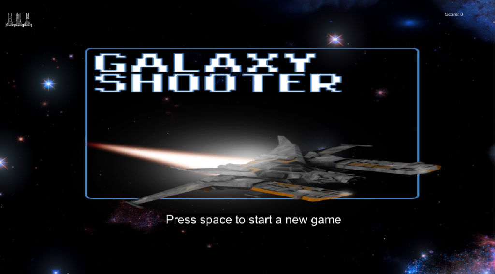
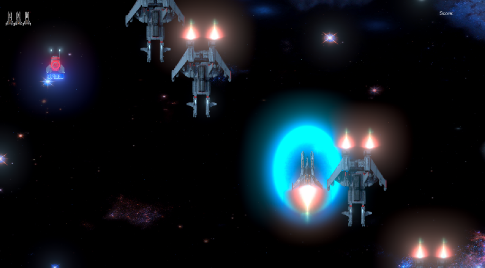
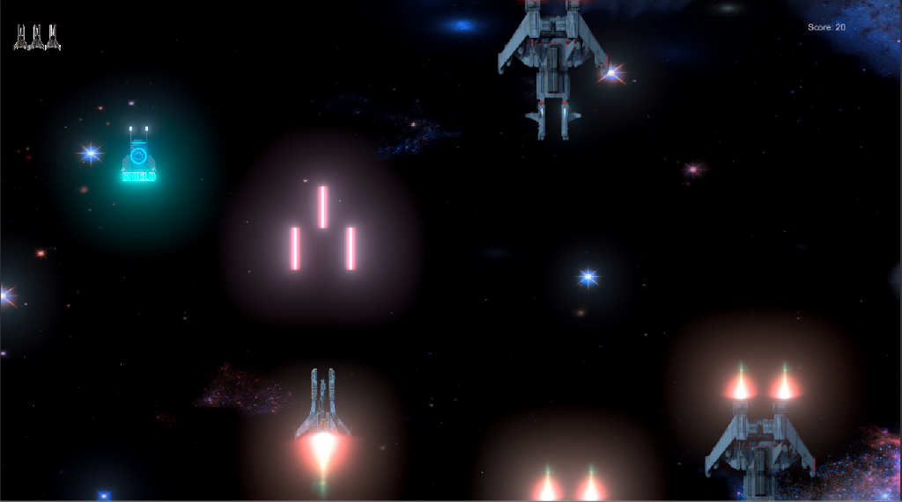
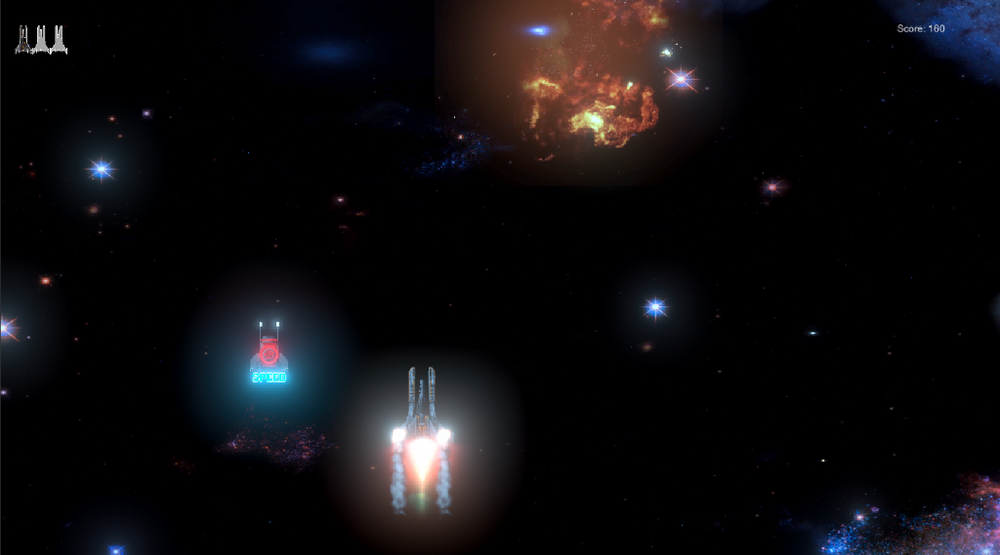

# Galaxy Shooter
 Galaxy Shooter is a simple 2d game where player fights enemies and earn score

## Table of contents
* [General info](#general-info)
* [Screenshots](#screenshots)
* [Technologies](#technologies)
* [Status](#status)
* [Inspiration](#inspiration)
* [Contact](#contact)

## General info
Game consists of:
- One player who has three lives
- Enemies
- Three powerups:
  - Shield Powerup
  - Shot Powerup
  - Speed Powerup

## Screenshots

- #### Game Start
  

- #### Shield Powerup
  

- #### Shot Powerup
  

- #### Speed Powerup
  

## Technologies
* Unity - 2018.3

## Status
Project is: for development purpose

## Inspiration
Project inspired by [The Ultimate Guide To Game Development With Unity](https://www.udemy.com/the-ultimate-guide-to-game-development-with-unity/) udemy course

## Contact
Created by [Mohamed Abdelnaby Elattar](https://www.linkedin.com/in/maaelattar) - feel free to contact me!
